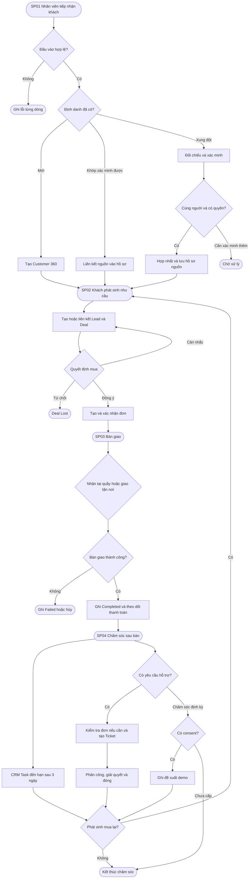

# BPMN nghiệp vụ SP01–SP04

```mermaid
flowchart TD
    I([SP01 Nhân viên tiếp nhận khách]) --> V{Đầu vào hợp lệ?}
    V -- Không --> E([Ghi lỗi từng dòng])
    V -- Có --> D{Định danh đã có?}
    D -- Mới --> C[Tạo Customer 360]
    D -- Khớp xác minh được --> A[Liên kết nguồn vào hồ sơ]
    D -- Xung đột --> X[Đối chiếu và xác minh]
    X --> M{Cùng người và có quyền?}
    M -- Có --> G[Hợp nhất và lưu hồ sơ nguồn]
    M -- Cần xác minh thêm --> Y([Chờ xử lý])
    C --> S([SP02 Khách phát sinh nhu cầu])
    A --> S
    G --> S
    S --> L[Tạo hoặc liên kết Lead và Deal]
    L --> B{Quyết định mua}
    B -- Cân nhắc --> L
    B -- Từ chối --> Z([Deal Lost])
    B -- Đồng ý --> O[Tạo và xác nhận đơn]
    O --> H([SP03 Bàn giao])
    H --> K{Nhận tại quầy hoặc giao tận nơi}
    K --> F{Bàn giao thành công?}
    F -- Không --> J([Ghi Failed hoặc hủy])
    F -- Có --> P[Ghi Completed và theo dõi thanh toán]
    P --> Q([SP04 Chăm sóc sau bán])
    Q --> T[CRM Task đến hạn sau 3 ngày]
    Q --> R{Có yêu cầu hỗ trợ?}
    R -- Có --> N[Kiểm tra đơn nếu cần và tạo Ticket]
    N --> W[Phân công, giải quyết và đóng]
    R -- Chăm sóc định kỳ --> U{Có consent?}
    U -- Có --> FQ[Ghi đề xuất demo]
    U -- Chưa cấp --> END([Kết thúc chăm sóc])
    W --> RE{Phát sinh mua lại?}
    T --> RE
    FQ --> RE
    RE -- Có --> S
    RE -- Không --> END
```

[Bảng truy vết](../testing/bpmn-traceability.md) gắn từng nhánh với test và minh chứng.
